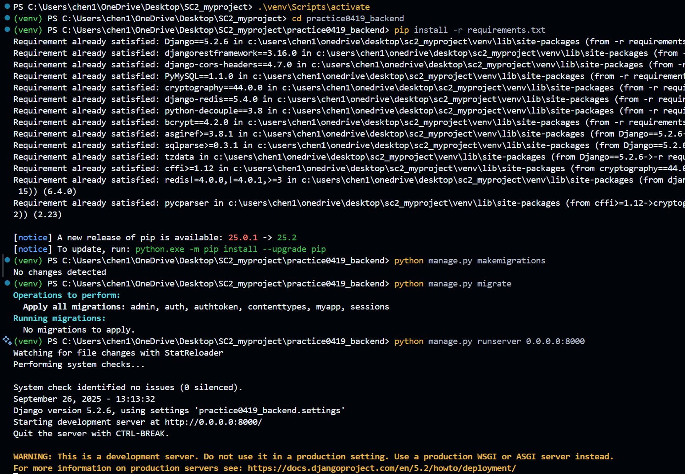

<div align="center">
  <h1>SC2_myproject</h1>
  <p>現代化全端專案：Django (後端) + Flutter (前端)</p>
</div>

---

## 目錄
- [目錄](#目錄)
- [專案簡介](#專案簡介)
- [技術棧](#技術棧)
- [安裝與啟動](#安裝與啟動)
  - [1. 設定 SECRET\_KEY](#1-設定-secret_key)
  - [2. 設定本地資料庫](#2-設定本地資料庫)
  - [3. 後端](#3-後端)
  - [4. 前端](#4-前端)
- [資料夾結構](#資料夾結構)

---

## 專案簡介
一個模擬電商平台的全端專案，讓你體驗線上購物網站的運作流程。你可以註冊帳號、瀏覽商品、下訂單、管理個人資訊等，感受現代電商平台的基本功能。這類平台在現實生活中廣泛應用於零售、品牌直營、二手交易等領域，協助商家將商品推廣給更多消費者，也讓消費者能夠隨時隨地選購所需商品，提升購物便利性與效率。

## 技術棧
- **後端**：Python 3.x, Django, Django REST Framework
- **前端**：Flutter (Dart)
- **資料庫**：MySQL
- **開發工具**：VS Code, Android Studio

## 安裝與啟動

### 1. 設定 SECRET_KEY
- 為了專案安全，請在本機環境變數中設定 `SECRET_KEY`，否則會使用預設值 `dev-secret-key`。
- Windows 設定方式（PowerShell） :
  ```powershell
  $env:SECRET_KEY = 'your-very-secret-key'
  ```

### 2. 設定本地資料庫
- 安裝並設定 MySQL，建立一個新的資料庫（例如：`test0419`）。
- 在 `practice0419_backend/practice0419_backend/settings.py` 中，確認或修改如下設定：

```python
DATABASES = {
    'default': {
        'ENGINE': 'django.db.backends.mysql',
        'NAME': 'test0419',  # 你的資料庫名稱
        'USER': 'root',      # 你的 MySQL 使用者
        'PASSWORD':  os.getenv('DB_PASSWORD', default='your_db_password'),
        'HOST':  'localhost',
        'PORT':  '3306',
        'OPTIONS': {
            'charset': 'utf8mb4',
        },
    }
}
```

- 建議將 `DB_PASSWORD` 設定於本機環境變數，避免密碼寫死在程式碼。

### 3. 後端
```bash
# 啟動虛擬環境 Windows
.\venv\Scripts\activate

# 進入後端目錄
cd practice0419_backend

# 安裝依賴套件
pip install -r requirements.txt

# 執行資料庫遷移
python manage.py makemigrations
python manage.py migrate

# 啟動開發伺服器
python manage.py runserver 0.0.0.0:8000
```



**注意事項:**
- 伺服器會在 `http://127.0.0.1:8000/` 啟動
- API 端點包括：
  - `POST /api/register/` - 使用者註冊
  - `POST /api/login/` - 使用者登入（使用 email + password）
  - `GET /api/products/` - 取得商品列表
  - `GET /api/orders/` - 取得使用者訂單（需認證）
  - `POST /api/orders/` - 建立新訂單（需認證）
- 使用 Token 認證機制，登入後會取得 token 用於後續 API 請求

### 4. 前端
```bash
cd practice0419_frontend
flutter pub get
flutter run
```

## 資料夾結構
```
SC2_myproject/
├── practice0419_backend/  # Django 後端
│   ├── myapp/             # 核心應用程式 (models, views, serializers...)
│   ├── requirements.txt   # Python 依賴
│   └── ...
├── practice0419_frontend/ # Flutter 前端
│   ├── lib/               # Dart 原始碼
│   ├── pubspec.yaml       # Flutter 依賴
│   └── ...
├── venv/               # Python 虛擬環境
└── README.md
```